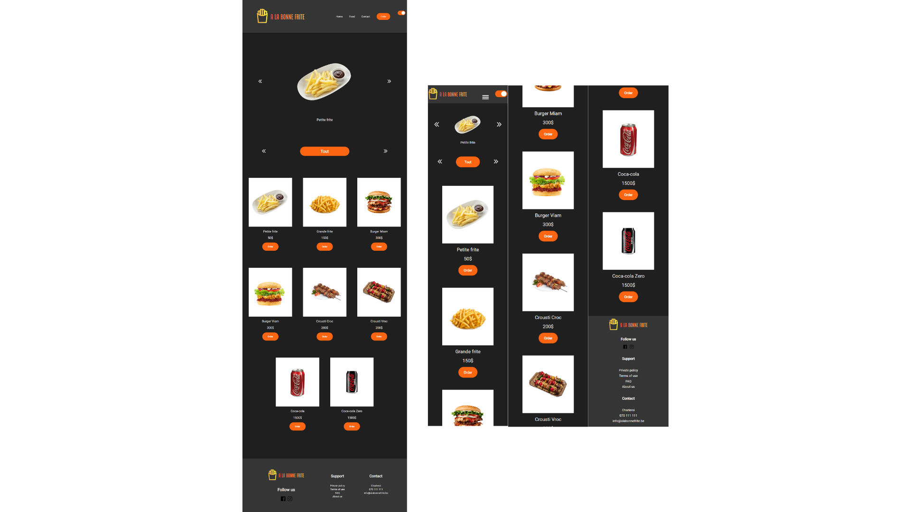

# Kitchen-Project

In this repository, you will find our project that finalizes our basic learning of DOM oriented Javascript.

This site is responsive and includes a mobile version and a desktop version. It also contains a dark mode and a light mode. The articles are generated from a Json file.

---

Project completed

This repository was created and edited on December 09, 2022. This project is an exercise realized during the training web developer junior given by Becode.org

---

## Language

- HTML
- SCSS
- JS

---

## How to install the repository locally

1. create a local working folder
2. open Git Bash
3. clone the repository
4. now you can work on the file

---

[Link to my Github page.](https://mathildecornelis.github.io/Dark-Kitchen-Project/)
